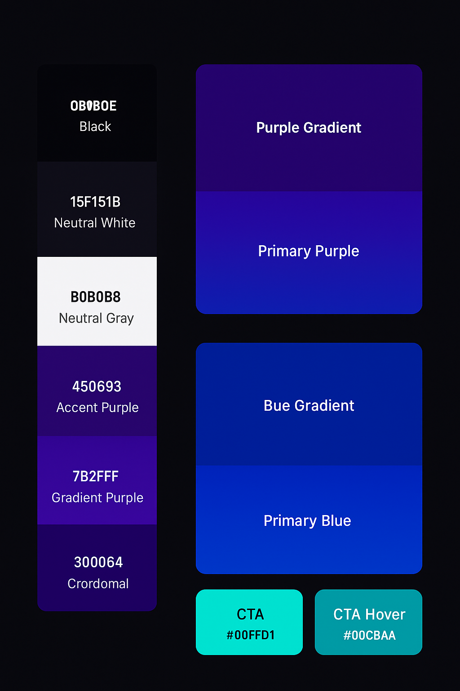

# POS_System

Projects have self-hosted SpringBoot API on a Rocky Linux PC, reverse-proxied through Nginx with SSL termination using Let’s Encrypt, and assigned a public-facing subdomain: jwt-auth.duckdns.org. The API is connected to a locally-hosted Postgresql database on the same machine. Vercel hosts the Nextjs frontend: pos-system-two-alpha.vercel.app, which communicates securely with the database via the RESTful API.

<details>
<summary>

## Step - 0</summary>

### Domain Modeling

Define core entities and relationships (e.g., Sales, Users, Products, etc.)

This is all about understanding the business logic first before any code is written.

Output: ER diagrams, DB schemas, object models.
</details>

<details>
<summary>

## Step - 1</summary>

### Choose the Tech Stack

Decide what languages, frameworks, and tools you're going to use:

## Backend: Java + Spring Boot ✅

🔥 Why it's great for your POS system:
Mature ecosystem: Spring Boot is widely used in production systems — battle-tested and reliable.

Rapid development: Auto-configuration and embedded server (Tomcat) let you build REST APIs fast.

Security: Built-in support for authentication/authorization (Spring Security + JWT).

Layered architecture: Makes it easy to organize business logic, especially for CRUD-heavy apps like POS.

ORM Support: Works seamlessly with JPA and Hibernate for SQL databases like PostgreSQL.

📦 Example: You’ll use @RestController to create your API endpoints like /products, /sales, and @Entity for data models.

## Frontend: Next.js ✅

🔥 Why it fits perfectly:
App Router: Built-in routing makes it super easy to map pages (/login, /products, /checkout).

Server-side rendering (SSR): Great for fast-loading admin dashboards or public-facing pages.

API Routes (if needed): You can handle minor frontend logic without touching the backend.

Component reusability: Build modular UI like <ProductCard />, <SaleForm />, etc.

SEO-friendly: If you ever want to make a public site from your POS (like a storefront), it’s already optimized.

📦 Example: The cashier dashboard could be at /dashboard/cashier, and the admin panel at /dashboard/admin.

## Database: PostgreSQL

🔥 Why it's a strong choice:
Relational database: Perfect for structured data like products, sales, users, and inventory.

ACID compliance: Ensures reliable transactions, which is a must for things like checkout, refunds, etc.

Great with JPA: PostgreSQL works beautifully with Spring Data JPA.

Indexing + full-text search: If you need quick lookups (like product names or SKUs), it handles it well.

📦 Example: A sales table can link to sale_items, users, and customers using foreign keys.

## Hosting/Infra: Docker, Nginx, Vercel, etc

🔥 Docker
Environment consistency: No “it works on my machine” issues.

Easy deployments: Build once, run anywhere — especially helpful for your Spring Boot API.

Docker Compose: Easily spin up your backend, database, and even dev UI with one command.

📦 Example: Run PostgreSQL + Spring Boot + Nginx in containers locally or on your mini PC.

🔥 Nginx
Reverse proxy: Route traffic from your domain to your Spring Boot backend.

SSL termination: Serve your backend over HTTPS using Let’s Encrypt.

Load balancing (future-ready): If your API ever scales.

📦 Example: api.mydomain.com → Nginx → Spring Boot server running on port 8080.

🔥 Vercel
Optimized for Next.js: It’s literally built by the creators of Next.js.

Instant deployments: Push to GitHub → Vercel deploys it automatically.

Fast CDN: Serves your static content quickly, even globally.

📦 Example: Your POS frontend (cashier/admin login, product list UI) will be fast and deploy with ease.

    Tech        |   Why it’s great
    Spring Boot |   Enterprise-grade backend, RESTful APIs, security
    Next.js     |   Clean routing, server-side rendering, fast frontend
    PostgreSQL  |   Reliable, structured, and ACID-compliant data storage
    Docker      |   Portable, consistent deployments
    Nginx       |   SSL, routing, reverse proxy
    Redis       |   Caching for optimized data querying
    Vercel      |   Seamless deployment for your frontend
</details>

<details>
<summary>

## Step - 1.5</summary>

### Design UI/UX Flow

#### Colors

🎨 Overall Concept

Background: Deep black or near-black for a sleek, modern look.
Text/Foreground: Soft whites and subtle grays for contrast without eye strain.
Accent Colors: Slightly lighter or saturated variants of purple/blue for highlights or hover effects.
Call-to-Action (CTA): A bold, energetic color that pops against both purple and blue (think neon cyan or electric pink).



🖤 Neutrals

```
    | Role              | Color               | Hex       | Notes                                                 |
    | ----------------- | ------------------- | --------- | ----------------------------------------------------- |
    | Background        | `--neutral-black`   | `#0B0B0E` | Almost black with a cool undertone; helps colors pop. |
    | Surface / Card BG | `--neutral-surface` | `#15151B` | For sections or cards to subtly stand off background. |
    | Text Primary      | `--neutral-white`   | `#F5F5F7` | Clean white, not harsh pure white.                    |
    | Text Secondary    | `--neutral-gray`    | `#B0B0B8` | Muted gray for secondary text or labels.              |
```

💜 Purple Theme (first section)

```
    | Role          | Color               | Hex       | Notes                                                           |
    | ------------- | ------------------- | --------- | --------------------------------------------------------------- |
    | Primary       | `--primary-purple`  | `#450693` | Your chosen rich royal purple.                                  |
    | Accent        | `--accent-purple`   | `#7B2FFF` | Slightly lighter, vibrant violet for hover states or gradients. |
    | Gradient Pair | `--gradient-purple` | `#300064` | Deep companion for transitions/gradients.                       |
```

Use case: Background gradients like
background: linear-gradient(180deg, #300064 0%, #450693 100%);

💙 Blue Theme (later section)

```
    | Role          | Color             | Hex       | Notes                                         |
    | ------------- | ----------------- | --------- | --------------------------------------------- |
    | Primary       | `--primary-blue`  | `#0046FF` | Your chosen vivid blue.                       |
    | Accent        | `--accent-blue`   | `#5A8CFF` | Lighter sky-blue for highlights/hover states. |
    | Gradient Pair | `--gradient-blue` | `#002C99` | Deep navy partner for depth.                  |
```

Use case:
background: linear-gradient(180deg, #002C99 0%, #0046FF 100%);

⚡ CTA / Hover / Active Color

```
| Role           | Color         | Hex       | Notes                                                         |
| -------------- | ------------- | --------- | ------------------------------------------------------------- |
| CTA / Hover    | `--cta`       | `#00FFD1` | Neon cyan/teal that pops beautifully on both purple and blue. |
| CTA Hover Dark | `--cta-hover` | `#00CBAA` | Slightly darker for hover or active states.                   |
```

This aqua/cyan contrasts sharply against dark backgrounds and sits harmoniously between your purple and blue — great for buttons like “Checkout,” “Add Product,” or “Login.”

#### Wireframes, frontend page routes

🗂️ 1. Organize Your Wireframes by Views

These are your visual pages/screens:

    View Name           | Description                       | Example Route
    Login               | Auth page for cashier/admin login | /login
    Dashboard (Admin)   | Overview of system stats          | /dashboard/admin
    Dashboard (Cashier) | Access to POS terminal            | /dashboard/cashier
    Product List        | Manage inventory                  | /products
    New Product Form    | Add/edit product info             | /products/new
    Sale Terminal       | Add items to sale, checkout       | /sales/new
    Sales History       | View past transactions            | /sales
    Customers Page      | View/add customers                | /customers
    Settings            | Manage users/roles/passwords      | /settings

🧱 2. Connect to Backend Entities

Each page/view pulls or updates data tied to entities:

    Route       | Main Entity | Supporting Entities
    /login      | User        | —
    /products   | Product     | InventoryLog
    /sales/new  | Sale        | SaleItem, Product, User
    /sales      | Sale        | Customer, User
    /customers  | Customer    | Sale
    /settings   | User        | —

🔗 3. Define Matching API Endpoints

Example routes your Spring Boot backend could expose:

    API Endpoint            | Method    | Description
    POST /api/auth/login    | POST      | Login with JWT
    GET /api/products       | GET       | List all products
    POST /api/products      | POST      | Add new product
    GET /api/sales          | GET       | List all sales
    POST /api/sales         | POST      | Create a new sale
    GET /api/customers      | GET       | Get all customers
    POST /api/customers     | POST      | Add new customer
    GET /api/users          | GET       | Admin user management

</details>

<details>
<summary>

## Step - 2</summary>

### System Architecture Design

Define how components talk to each other -- REST API endpoints, Auth strategy (e.g., JWT), Microservices? Or single backend? Do you use caching, queuing, etc.?

Diagrams: sequence diagrams, flow diagrams, etc.

<details>
<summary>1. 🔭 High-Level Overview</summary>
You’re building a web-based POS system. So your architecture will likely look like this:

    [ Frontend (Next.js 15+) ]
            |
            v
    [ API Gateway / Nginx (optional for SSL + routing) ]
            |
            v
    [ Spring Boot REST API ]
            |
            v
    [ Redis Caching (chceks availability) ]
            |
            v
    [ Database (PostgreSQL) ]

You can also run background jobs, use WebSocket for real-time updates (optional), or include a queue for receipts/logs later.
</details>

<details>
<summary>2. 🔗 Frontend–Backend Communication</summary>
Frontend: Next.js 15+ using App Router and fetch()/axios to hit your backend endpoints.

Backend: Spring Boot exposes RESTful routes:

POST /auth/login

GET /products

POST /sales

etc.

Authentication will use JWTs stored in cookies.
</details>

<details>
<summary>3. 🧱 Backend Layers</summary>
Use the classic layered architecture:

    [Controller]    ->    [Service]    ->    [Repository]
        ↑                     ↑                   ↑
    REST API              (logic)            (Data access)

@RestController handles requests

@Service contains logic (e.g., discount rules)

@Repository uses JPA or MongoRepository for DB
</details>

<details>
<summary>4. 🔐 Authentication Strategy</summary>
✅ You're planning to use JWT (JSON Web Tokens):

POST /auth/login → returns a JWT

Frontend stores token (secure cookie)

Backend uses a JWT filter to verify token on each request

You can use roles like "ADMIN", "CASHIER" for access control

Optional bonus: refresh tokens for long sessions.
</details>

<details>
<summary>5. 🔄 Data Flow Example (Selling a Product)</summary>

1. User logs in -> gets JWT
2. Adds items to cart on frontend
3. Frontend POSTs sale to /api/sales with JWT
4. Backend:
   - Validates user + inventory
   - Saves Sale + SaleItems
   - Updates inventory
5. Returns confirmation

That’s a classic POS workflow. Other flows: managing products, viewing reports, handling returns, etc.
</details>

<details>
<summary>🌐 6. Infrastructure / Hosting Plan</summary>
You already have a mini PC to host the backend API — that’s great!

    Component --> Plan

    Frontend (Next.js) --> Vercel
    Backend (Spring) --> Mini PC with Docker + Nginx + SSL
    Database --> PostgreSQL on Mini PC
    Domain & SSL --> Free domain + Let’s Encrypt SSL
    Reverse Proxy --> Nginx

You can use Docker Compose to run everything locally on your mini PC and port-forward for internet access.
</details>

🧠...

Do you want real-time updates? (e.g., WebSocket for sales activity?)

Will there be a dashboard/admin view?
</details>

<details>
<summary>

## Step - 3</summary>

### Scaffold the Project

- Initialize your Spring Boot App and Next.js frontend

- Connect to the database

- Create your core entity classes & repositories

- Set up auth, initial routes and API base structure

</details>

<details>
<summary>

## Step - 4</summary>

### Implementing Core Features

- Product CRUD

- User Auth/Login

- Sales flow(scan -> cart -> checkout -> record/log)

- Payment Logic

- Inventory tracking

- Build in small vertical slices(one feature end-to-end)

</details>

<details>
<summary>

## Step - 5</summary>

### Testing & Iteration

- Unit tests, integration tests

- Manual testing of flows

- Fix edge cases (discounts, returns, etc.)

</details>

<details>
<summary>

## Step - 6</summary>

### Deployment & Monitoring

- Containerize with Docker

- Deploy backend (on mini PC)

- Host frontend on Vercel

- Add monitoring/logging if needed

</details>
