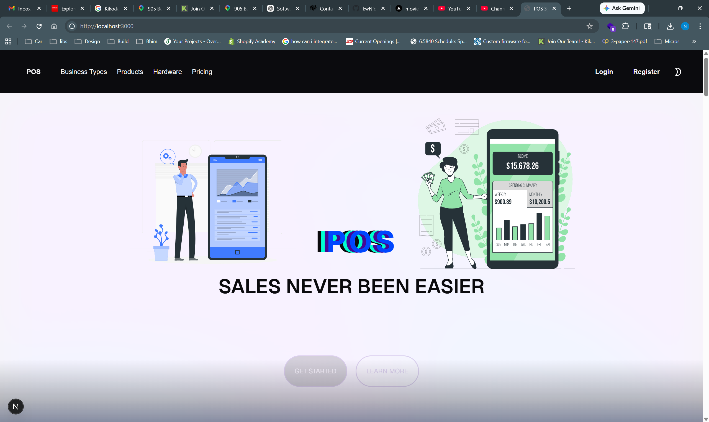

This is a [Next.js](https://nextjs.org) project bootstrapped with [`create-next-app`](https://nextjs.org/docs/app/api-reference/cli/create-next-app).

## Demo Video

[](https://youtu.be/HpIIT2wax2g)

```text
                 POS DATABASE
                      │
          ┌───────────┴───────────┐
          │                       │
      Spring Boot              SQL
       REST API               queries
          │                       │
          └───────────┬───────────┘
                      │
                    Next.js
                      │
             ┌────────┴────────┐
             │                 │
          POS UI          Analytics
```

```text
        users
        │
        ├── user_roles
        │       │
        │       └── roles
        │
        └── shop_users
                │
                └── shops
                        │
                        └── registers
                                │
                                └── sales
                                    │
                                    ├── sale_items
                                    │      │
                                    │      └── products
                                    │
                                    └── payments
```

```text
        Today's Sales       $4,382.25

        Transactions             127

        Average Order          $34.51

        Top Product
        └── Widget A          83 sold

        Sales by Shop
        ├── Shop A          $2,431
        ├── Shop B          $1,284
        └── Shop C            $667
```

```text
                                 ┌───────────┐
                                 │  users    │
                                 └─────┬─────┘
                                       │
                                       │
        ┌───────────┐             ┌────▼─────┐
        │   shops   │────────────►│  sales   │
        └───────────┘             └────┬─────┘
                                       │
                            ┌──────────┴──────────┐
                            │                     │
                      ┌─────▼──────┐        ┌─────▼──────┐
                      │ sale_items │        │  payments  │
                      └─────┬──────┘        └────────────┘
                            │
                            │
                      ┌─────▼──────┐
                      │  products  │
                      └────────────┘
```

This is where your question about @OneToMany and @ManyToMany is important.

You actually don't want a @ManyToMany between Sale and Product directly.

Conceptually, yes:

```text
    Sale       Product
    │           │
    │ many      │ many
    └─────┬─────┘
            │
        sale_items
```

A sale can contain many products.

A product can appear in many sales.

So mathematically that's a many-to-many relationship.

But sale_items has additional information:

quantity
unit_price
subtotal

That makes SaleItem an association entity.

So your JPA model should be:

```text
Sale
 │
 │ @OneToMany
 ▼
SaleItem
 │
 │ @ManyToOne
 ▼
Product
```

```text
CREATE TABLE products (
    id BIGSERIAL PRIMARY KEY,
    name VARCHAR(150) NOT NULL,
    description TEXT,
    sku VARCHAR(50) NOT NULL UNIQUE,
    price NUMERIC(10, 2) NOT NULL CHECK (price >= 0),
    stock_quantity INTEGER NOT NULL DEFAULT 0 CHECK (stock_quantity >= 0),
    active BOOLEAN NOT NULL DEFAULT TRUE,
    created_at TIMESTAMP NOT NULL DEFAULT CURRENT_TIMESTAMP,
    updated_at TIMESTAMP NOT NULL DEFAULT CURRENT_TIMESTAMP
);

CREATE TABLE sales (
    id BIGSERIAL PRIMARY KEY,
    shop_id BIGINT NOT NULL,
    user_id BIGINT NOT NULL,

    subtotal NUMERIC(10, 2) NOT NULL CHECK (subtotal >= 0),
    tax NUMERIC(10, 2) NOT NULL DEFAULT 0 CHECK (tax >= 0),
    discount NUMERIC(10, 2) NOT NULL DEFAULT 0 CHECK (discount >= 0),
    total NUMERIC(10, 2) NOT NULL CHECK (total >= 0),

    status VARCHAR(30) NOT NULL DEFAULT 'COMPLETED',

    created_at TIMESTAMP NOT NULL DEFAULT CURRENT_TIMESTAMP,

    CONSTRAINT fk_sales_shop
        FOREIGN KEY (shop_id)
        REFERENCES shops(id),

    CONSTRAINT fk_sales_user
        FOREIGN KEY (user_id)
        REFERENCES users(id)
);

CREATE TABLE sale_items (
    id BIGSERIAL PRIMARY KEY,

    sale_id BIGINT NOT NULL,
    product_id BIGINT NOT NULL,

    quantity INTEGER NOT NULL CHECK (quantity > 0),
    unit_price NUMERIC(10, 2) NOT NULL CHECK (unit_price >= 0),
    subtotal NUMERIC(10, 2) NOT NULL CHECK (subtotal >= 0),

    CONSTRAINT fk_sale_items_sale
        FOREIGN KEY (sale_id)
        REFERENCES sales(id)
        ON DELETE CASCADE,

    CONSTRAINT fk_sale_items_product
        FOREIGN KEY (product_id)
        REFERENCES products(id)
);

CREATE TABLE payments (
    id BIGSERIAL PRIMARY KEY,

    sale_id BIGINT NOT NULL,

    payment_method VARCHAR(30) NOT NULL,
    amount NUMERIC(10, 2) NOT NULL CHECK (amount > 0),

    status VARCHAR(30) NOT NULL DEFAULT 'COMPLETED',

    transaction_reference VARCHAR(150),

    created_at TIMESTAMP NOT NULL DEFAULT CURRENT_TIMESTAMP,

    CONSTRAINT fk_payments_sale
        FOREIGN KEY (sale_id)
        REFERENCES sales(id)
        ON DELETE CASCADE
);
```
